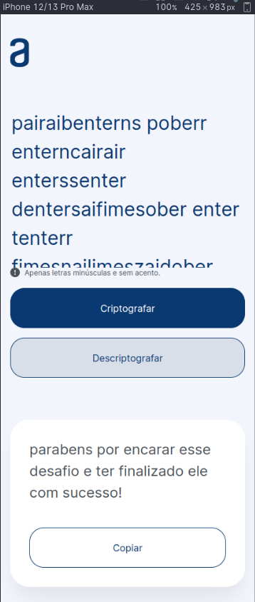

# Decodificador

Este é um projeto de decodificador que permite criptografar e descriptografar mensagens. Ele foi desenvolvido utilizando HTML, CSS e JavaScript.

## Visualização - Desktop

    

## Visualização - Mobile

    

## Funcionalidades

O decodificador possui as seguintes funcionalidades:

- Criptografar: Permite criptografar um texto inserido pelo usuário.
- Descriptografar: Permite descriptografar um texto criptografado inserido pelo usuário.
- Copiar: Permite copiar o resultado da criptografia ou descriptografia para a área de transferência.

## Pré-requisitos

Antes de executar o projeto, verifique se o seu ambiente atende aos seguintes requisitos:

- Navegador web atualizado

## Instalação

Siga as instruções abaixo para executar o projeto em seu ambiente local:

1. Faça o download dos arquivos HTML, CSS e JavaScript.
2. Abra o arquivo HTML em um navegador web.

## Utilização

Após abrir o projeto no navegador, você verá a interface do decodificador. A interface consiste em três partes principais:

1. Área de texto: Insira o texto que você deseja criptografar ou descriptografar nesta área.
2. Aviso: Uma mensagem de aviso será exibida se o texto contiver caracteres inválidos.
3. Botões: Há dois botões disponíveis: "Criptografar" e "Descriptografar". Clique nos botões para executar as respectivas ações.
4. Resultado: O resultado da criptografia ou descriptografia será exibido nesta área. Você pode copiar o resultado clicando no botão "Copiar".

Certifique-se de seguir as instruções e restrições específicas do decodificador ao inserir o texto.